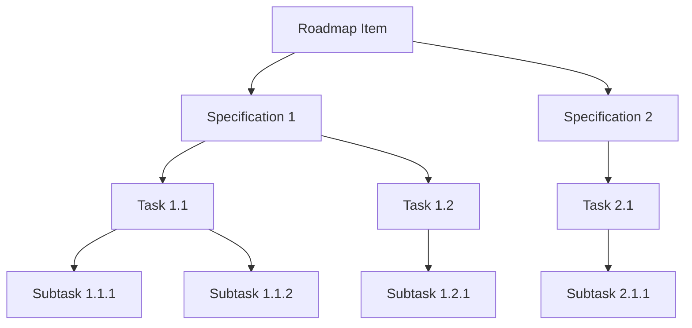

# blprnt User Guide

**blprnt** is an AI-powered coding assistant desktop application that helps you ship code faster with less debugging and googling. It provides a rich conversational interface backed by multiple AI providers, intelligent code manipulation tools, and structured project management capabilities.

***

## Core Capabilities

### Multi-Provider AI Support

blprnt supports multiple AI providers, allowing you to choose the best model for your needs:

| Provider | Supported Models | Key Features |
|----------|-----------------|--------------|
| **Anthropic** | Sonnet 4.5 \\| 4.0 \\| 3.7, Opus 4.1 \\| 4.0, Haiku 3.5 | Extended thinking, vision support, 200K context |
| **OpenAI** | GPT-5-Codex, GPT-5, GPT-5-mini, GPT-5-nano, GPT-4.1, GPT-4.1-mini, GPT-4.1-nano | Reasoning models, vision support |
| **Google Gemini** (coming soon) | Gemini 2.0, Gemini 1.5 Pro/Flash | Fast inference, large context windows |
| **DeepSeek** (coming soon) | DeepSeek R1, V3 | Cost-effective, code-focused |
| **Ollama** (coming soon) | Local models | Run models locally, privacy-first |
| **OpenRouter** (coming soon) | Multi-provider gateway | Access to various models through one API |

### Session Management

Create and manage isolated work sessions with different configurations:

* **Multiple Sessions**: Run concurrent sessions with different models and settings
* **Session History**: Access previous conversations and restore context
* **Session Switching**: Quickly switch between active sessions
* **Session Configuration**: Customize workspace directory and sandbox settings per session

## User Interface

### Conversation View

The main interface is split into two panels:

#### Left Panel: Conversation

* **Message Cards**: View user messages and AI responses with timestamps
* **Rich Formatting**: Markdown rendering with syntax-highlighted code blocks
* **Context Menu**: Copy messages, view raw content
* **Auto-scroll**: Automatically follows the conversation

#### Right Panel: Agent Activity

* **Actions Timeline**: Real-time view of AI tool usage (file edits, searches, etc.)
* **Reasoning Display**: See the AI's extended thinking process
* **Plan Queue**: Visual task breakdown showing pending, in-progress, and completed items
* **Collapsible Items**: Expand/collapse individual actions for better focus

### Header Controls

The header provides quick access to session settings:

| Control | Function |
|---------|----------|
| **Auth Selector** | Switch between configured provider credentials |
| **Model Selector** | Change the AI model for current session |
| **Reasoning Effort** | Adjust thinking depth (High, Medium, Low, Minimal, None) |
| **Context Usage** | View token consumption in real-time |
| **Running State** | Shows active/idle status with visual indicator |

### Sidebar Navigation

* **New Session**: Create a new coding session
* **Open Sessions**: Quick access to active sessions
* **Previous Sessions**: Browse and restore past conversations

***

## Onboarding Experience

First-time users are guided through a 4-step setup:

1. **Welcome Screen**: Introduction with animated tagline
2. **Provider Setup**: Add your first AI provider with API key or OAuth
3. **Model Selection**: Choose from available models with detailed specifications
4. **Workspace Configuration**: Set working directory and security preferences

***

## Sandbox Modes

Control how blprnt interacts with your system through three security modes:

### YOLO Mode 🚀

* **No restrictions**: AI can read, write, and execute commands freely
* **Automatic approval**: All tool uses are immediately executed
* **Best for**: Trusted environments, rapid prototyping, experienced users

### Standard Mode (Network + File Write)

* **Network access**: AI can make external API calls
* **File operations**: Read and write files with discretion
* **Interactive approval**: Review tool uses before execution (optional)
* **Best for**: Most development workflows

### Read-Only Mode 🔒

* **File reading only**: AI can browse and analyze code but cannot modify files
* **No writes**: Prevents accidental changes
* **Safe exploration**: Review and understand codebases without risk
* **Best for**: Code review, learning, exploring unfamiliar projects

| Feature | YOLO | Standard | Read-Only |
|---------|------|----------|-----------|
| Read Files | ✅ | ✅ | ✅ |
| Write Files | ✅ | ✅ | ❌ |
| Delete Files | ✅ | ✅ | ❌ |
| Execute Commands | ✅ | ✅ | ❌ |
| Network Access | ✅ | ✅ | ❌ |

***

## AI Capabilities

### File Operations

The AI can manipulate files in your workspace with precision:

| Operation | Description | Use Case |
|-----------|-------------|----------|
| **Create** | Generate new files with content | Scaffold components, create configs |
| **Read** | View file contents (full or line range) | Understand existing code |
| **Update** | Find and replace text (literal match) | Simple text substitutions |
| **Patch** | Apply unified diffs for complex edits | Multi-line refactoring |
| **Delete** | Remove files | Clean up obsolete code |
| **Search** | Find text patterns across files (regex) | Locate usage, find TODOs |

### Code Intelligence

#### Symbol Extraction

Parse source files to extract:

* Functions and methods
* Classes, structs, enums, traits
* Top-level declarations
* Type definitions

**Supported Languages**: Python, JavaScript/TypeScript, Rust, Go, Java, C/C++, C#

#### Code Renaming

Batch-rename symbols across your entire workspace:

* Word-boundary matching for accuracy
* Preview mode (dry run) before applying
* Respects `.blprntignore` files
* Validates new names against language keywords

### Directory Operations

| Tool | Purpose | Example |
|------|---------|---------|
| **Tree View** | Visualize project structure | "Show me the directory layout" |
| **Search** | Find files/folders by name pattern | "Find all test files" |

### Knowledge Base

Build a persistent knowledge repository accessible across sessions:

* **Create**: Store documentation, patterns, and learnings
* **Search**: Find relevant knowledge with semantic search
* **Organize**: Tag and categorize entries
* **Update**: Keep knowledge current
* **List/Filter**: Browse by category or tags

**Use Cases**:

* Project-specific conventions
* API documentation
* Architecture decisions
* Common commands and workflows

### Project Management

Structured task tracking with hierarchical organization:



#### Hierarchy

1. **Roadmap**: High-level feature or epic
   * Title, description (markdown), priority, status
2. **Specification**: Detailed technical design linked to roadmap
   * Full spec + lite version, priority, status
3. **Task**: Specific implementation work under a spec
   * Title, description, status, effort estimate
4. **Subtask**: Granular steps within a task
   * Title, status, priority

**Example Workflow**:

```
User: "Break down the authentication feature into tasks"
AI: Creates roadmap → specs → tasks → subtasks with descriptions
```

### Planning System

The AI can create and manage a visual task queue:

* **Plan Items**: Discrete steps shown in the right panel
* **Status Tracking**: Pending → In Progress → Completed
* **Visual Updates**: Real-time progress indication
* **Queue Management**: FIFO task execution

***

## Model Selection

Each provider offers models with different characteristics:

### Key Attributes

| Attribute | Description | Impact |
|-----------|-------------|--------|
| **Family** | Model lineage (e.g., claude-sonnet, gpt-4) | Capability baseline |
| **Speed** | Response latency | Fast ↔ Slow |
| **Quality** | Output accuracy and reasoning | Basic ↔ Premium |
| **Context Window** | Max input tokens | How much code can be analyzed |
| **Max Output** | Max response tokens | How much code can be generated |
| **Pricing** | Cost per 1M tokens | Input and output rates |

### Model Capabilities

Models support different features:

| Capability | Description |
|------------|-------------|
| **Tools** | Can use file operations, code tools, etc. |
| **Vision** | Can analyze images and screenshots |
| **Reasoning** | Supports extended thinking with adjustable effort |

### Reasoning Effort

For models with extended thinking (Claude Sonnet 4.5, o3-mini):

* **High**: Maximum reasoning depth, best for complex problems
* **Medium**: Balanced thinking time and cost
* **Low**: Quick reasoning for simpler tasks
* **Minimal**: Very brief thinking
* **None**: Direct response without extended reasoning

***

## Practical Usage Patterns

### Code Review

```
Mode: Read-Only
Prompt: "Review this codebase for security issues and code smells"
```

### Feature Implementation

```
Mode: Standard or YOLO
Prompt: "Implement user authentication with JWT tokens"
AI: Creates plan → implements files → writes tests → updates docs
```

### Debugging

```
Mode: Standard
Prompt: "Fix the race condition in the payment processing logic"
AI: Analyzes code → identifies issue → proposes fix → applies patch
```

### Documentation

```
Mode: Standard
Prompt: "Document all public APIs with JSDoc comments"
AI: Scans files → adds documentation → updates README
```

### Refactoring

```
Mode: Standard or YOLO
Prompt: "Extract this component into smaller, reusable pieces"
AI: Analyzes structure → creates plan → refactors → updates imports
```

***

## Keyboard & Interaction

### Input Panel

* **Enter**: Send message
* **Shift + Enter**: New line in message
* Disabled while AI is responding

### Model Selection

* **Arrow Up/Down**: Navigate model list during onboarding

### Context Menu (Right-click)

* Copy message content
* View raw message data
* Access additional actions

***

## Session Status Bar

The bottom status bar shows:

| Element | Information |
|---------|-------------|
| **CWD** | Current working directory path |
| **Session ID** | Unique identifier for current session |
| **Mode Badge** | Visual indicator when YOLO mode is active |

***

## Message Types

Different message styles for clarity:

| Type | Visual | Purpose |
|------|--------|---------|
| **User** | Blue accent border | Your prompts and questions |
| **Assistant** | Purple accent border | AI responses and explanations |
| **Action** | Timeline item (right panel) | Tool usage (file edits, searches) |
| **Reasoning** | Italic text (right panel) | AI's thinking process |
| **Info** | Blue info badge | System notifications |
| **Warning** | Yellow badge | Non-critical alerts |
| **Error** | Red badge | Failed operations or issues |

***

## Best Practices

### 💡 Getting the Most from blprnt

1. **Be Specific**: Include context and desired outcomes in prompts
   * ❌ "Fix the bug"
   * ✅ "Fix the null pointer exception in UserController.processPayment when amount is negative"

2. **Use Appropriate Modes**: Match sandbox mode to task
   * Code review → Read-Only
   * Implementation → Standard/YOLO
   * Learning → Read-Only

3. **Leverage Planning**: Let AI break down complex tasks
   * "Create a plan for implementing feature X, then execute it"

4. **Build Knowledge**: Store project-specific information
   * "Add our API authentication flow to the knowledge base"

5. **Right-size Models**: Balance cost and capability
   * Simple tasks → Faster, cheaper models
   * Complex architecture → Premium reasoning models

6. **Use Reasoning Effort**: Adjust thinking depth
   * Bug fix → Medium/Low
   * System design → High

7. **Session Organization**: Create focused sessions
   * Separate sessions for different features or tasks
   * Keep context relevant and manageable

***

## Context Management

### Token Usage Display

Real-time tracking in header shows:

* Current context size
* Percentage of model's limit
* Visual indicator when approaching limit

### Context Optimization

blprnt automatically:

* Compacts long conversations when needed
* Summarizes older context
* Maintains critical information

***

## Advanced Features

### Provider Authentication

**API Key**: Direct credential input
**OAuth** (Anthropic, OpenAI): Browser-based authentication flow

### Multiple Providers

* Add unlimited provider credentials
* Switch mid-session to different providers
* Each session can use a different auth

### Session Persistence

* Conversations saved automatically
* Restore previous sessions with full context
* Download session transcripts

### Interrupt/Cancel

* Stop AI mid-response with overlay
* Cancel long-running operations
* Resume or start new thought

***

## Tips & Tricks

### Efficient File Operations

```
"Show me the structure of src/ directory"
→ Uses dir_tree tool

"Find all components that use useState"
→ Uses file_search with pattern

"Rename handleClick to handleButtonClick across the project"
→ Uses code_rename tool
```

### Project Management Integration

```
"Create a roadmap for the e-commerce feature"
→ Creates roadmap item

"Break this down into specs and tasks"
→ Generates full hierarchy

"What tasks are pending?"
→ Lists incomplete tasks
```

### Knowledge Building

```
"Remember: we use Zod for all schema validation"
→ Stores in knowledge base

"What's our testing convention?"
→ Searches knowledge base

"Document the current session patterns"
→ Creates knowledge entry from context
```

***

## System Requirements

* **Desktop Application**: Native macOS, Windows, and Linux support
* **Network**: Required for cloud AI providers
* **Disk Space**: Minimal (sessions and knowledge stored locally)

***

## Getting Started

1. Launch blprnt
2. Complete onboarding (add provider, select model, configure workspace)
3. Start your first session
4. Ask the AI to help with your coding task

**Example First Prompts**:

* "Analyze the structure of this project"
* "What does this component do?" (after reading a file)
* "Create a new React component for user profiles"
* "Review this code for potential improvements"

***

## Troubleshooting

### Common Issues

**"Cannot submit prompt"**

* Session may be busy
* Check that model is selected
* Verify provider credentials

**"Tool execution failed"**

* Check file permissions
* Verify CWD is accessible
* Review sandbox mode settings

**"Context limit exceeded"**

* AI will auto-compact history
* Consider starting fresh session
* Use more focused prompts

**"Model not available"**

* Provider may be down
* Switch to different provider
* Check API key validity

***

## Privacy & Security

* **Local-first**: Sessions stored on your machine
* **Credentials**: API keys secured in system keychain
* **No telemetry**: Your code and conversations stay private
* **Sandbox isolation**: Controls what AI can access and modify

***

## Philosophy

**Less Googling. Less Debugging. Less Bullshit. More Shipping.**

blprnt is designed to keep you in flow state, reduce context switching, and amplify your productivity. It's not about replacing developers—it's about removing friction so you can focus on solving real problems.
