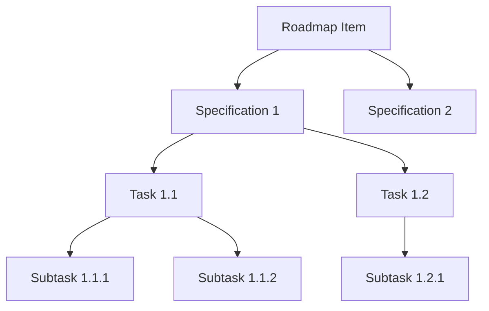

# blprnt User Guide

**blprnt** is an AI-powered coding assistant desktop application that helps you ship code faster with less debugging and googling. It provides a rich conversational interface backed by multiple AI providers, intelligent code manipulation tools, and structured project management capabilities.

***

## Core Capabilities

### Multi-Provider AI Support

blprnt supports multiple AI providers, allowing you to choose the best model for your needs:

| Provider | Supported Models | Key Features |
|----------|-----------------|--------------|
| **Anthropic** | Claude Sonnet 4.5, Claude Opus 4.1, Claude Opus 4.0, Claude Sonnet 4.0, Claude Haiku 3.7, Claude Haiku 3.5 | Extended thinking, vision support, 200K context |
| **OpenAI** | GPT-5.1, GPT-5, GPT-5-Codex, GPT-5-mini, GPT-5-nano, GPT-4.1, GPT-4.1-mini, GPT-4.1-nano | Reasoning models, vision support |
| **Google Gemini** | Gemini 3 Pro, Gemini 2.5 Pro/Flash | Fast inference, large context windows |
| **Grok** | Grok-4, Grok-3, Grok-3-mini | High performance, large context |

### Session Management

Create and manage isolated work sessions with different configurations:

* **Multiple Sessions**: Run concurrent sessions with different models and settings
* **Session History**: Access previous conversations and restore context
* **Session Switching**: Quickly switch between active sessions

## User Interface

### Modular Interface

blprnt features a highly flexible, tab-based interface powered by a docking system:

* **Tabs & Panels**: Every session, planning, and setting panel is a tab that can be moved, docked, or floated.
* **Flexible Layouts**: Drag and drop tabs to create your perfect workspace—split screens, grids, or side-by-side views.
* **Docking**: Snap panels to any edge of the window to organize your tools.
* **Persisted State**: Your layout is saved automatically, so you can pick up exactly where you left off.

### Session View

Each session is a self-contained tab that provides a unified stream of interaction:

* **Conversation Stream**: A single, vertical timeline containing:
  * **User Messages**: Your prompts and questions.
  * **AI Responses**: Rich text answers and code blocks.
  * **Agent Actions**: Real-time visibility into tool usage (file edits, searches) inline with the chat.
  * **Status Updates**: Live progress indicators for long-running tasks.

### Additional Views

The modular system supports various specialized views:

* **Project Settings**: Configure agent primers and directory settings.
* **Roadmap**: Visual planning board for project milestones.
* **Kanban**: Task management board.
* **Intro/Help**: Onboarding and documentation.

### Menu (Sidebar)

Access the main menu by clicking the blprnt logo in the top-left corner:

* **Projects Tree**: Browse all projects, sessions, and create new ones.
* **Manage Providers**: Add or edit AI provider credentials (Anthropic, OpenAI, Gemini, Grok).
* **Manage Personalities**: Configure custom agent behaviors and system prompts.
* **Version Info**: View current application version.

### Session Settings

Each session has configurable settings accessible via the settings icon in the session view:

| Setting | Options | Description |
|---------|---------|-------------|
| **Provider** | Anthropic, OpenAI, Gemini, Grok | Choose which AI provider to use |
| **Model** | Provider-specific models | Select the specific model (e.g., Claude 4.5 Sonnet, GPT-5.1) |
| **Reasoning Effort** | High, Medium, Low, Minimal, None | Adjust extended thinking depth for supported models |
| **Sandbox Mode** | YOLO, Standard, Read-Only | Control file and network access permissions |
| **Personality** | Custom personalities | Apply custom system prompts and behaviors |

***

## Onboarding Experience

First-time users are guided through a 3-step setup:

1. **Welcome**: Animated introduction to blprnt with the tagline "Less googling. Less debugging. Less Bullshit. More shipping."
2. **Provider Setup**: Add your first AI provider by selecting a provider (Anthropic, OpenAI, Gemini, Grok) and entering credentials.
3. **Project Creation**: Create your first project by:
   * Setting a project name and optional nickname
   * Selecting working directories
   * Optionally adding an agent primer (markdown-based context)

***

### YOLO Mode 🚀

* **No restrictions**: AI can read, write, and execute commands freely
* **Automatic approval**: All tool uses are immediately executed
* **Best for**: Trusted environments, rapid prototyping, experienced users

### Standard Mode (Network + File Write)

* **Network access**: AI can make external API calls
* **File operations**: Read and write files with discretion
* **Interactive approval**: Review tool uses before execution (optional)
* **Best for**: Most development workflows

### Read-Only Mode 🔒

* **File reading only**: AI can browse and analyze code but cannot modify files
* **No writes**: Prevents accidental changes
* **Safe exploration**: Review and understand codebases without risk
* **Best for**: Code review, learning, exploring unfamiliar projects

***

| Feature           | YOLO | Standard | Read-Only |
|-------------------|------|----------|-----------|
| Read Files        | ✅   | ✅       | ✅        |
| Write Files       | ✅   | ✅       | ❌        |
| Delete Files      | ✅   | ✅       | ❌        |
| Execute Commands  | ✅   | ✅       | ❌        |
| Network Access    | ✅   | ✅       | ❌        |
------------------------------------------------

***

## AI Capabilities

### File Operations

The AI can manipulate files in your workspace with precision:

***

| Operation  | Description                             | Use Case                            |
|------------|-----------------------------------------|-------------------------------------|
| **Create** | Generate new files with content         | Scaffold components, create configs |
| **Read**   | View file contents (full or line range) | Understand existing code            |
| **Update** | Find and replace text (literal match)   | Simple text substitutions           |
| **Delete** | Remove files                            | Clean up obsolete code              |
| **Search** | Find text patterns across files (regex) | Locate usage, find TODOs            |
----------------------------------------------------------------------------------------------

### Code Intelligence

#### Symbol Extraction

Parse source files to extract:

* Functions and methods
* Classes, structs, enums, traits
* Top-level declarations
* Type definitions

**Supported Languages**: Python, JavaScript/TypeScript, Rust, Go, Java, C/C++, C#

#### Code Renaming

Batch-rename symbols across your entire workspace:

* Word-boundary matching for accuracy
* Preview mode (dry run) before applying
* Respects `.blprntignore` files
* Validates new names against language keywords

### Directory Operations

| Tool | Purpose | Example |
|------|---------|---------|
| **Tree View** | Visualize project structure | "Show me the directory layout" |
| **Search** | Find files/folders by name pattern | "Find all test files" |

### Knowledge Base (coming soon)

Build a persistent knowledge repository accessible across sessions:

* **Create**: Store documentation, patterns, and learnings
* **Search**: Find relevant knowledge with semantic search
* **Organize**: Tag and categorize entries
* **Update**: Keep knowledge current
* **List/Filter**: Browse by category or tags

**Use Cases**:

* Project-specific conventions
* API documentation
* Architecture decisions
* Common commands and workflows

### Project Management

Structured task tracking with hierarchical organization:



#### Project Structure

* **Projects**: Top-level containers that define your working directory and settings.
* **Sessions**: All work happens within sessions, which are tied to specific projects.

#### Agent Primer

Each project supports an **Agent Primer**—a markdown-based context file that guides the AI's behavior for that specific project.

* **Purpose**: Provide background context, coding conventions, architectural decisions, and "rules of the road".
* **Usage**: The primer is automatically injected into the system prompt for every session in the project.
* **Benefits**: Ensures consistency across sessions and reduces the need to repeat instructions.

#### Hierarchy

1. **Roadmap**: High-level feature or epic
   * Title, description (markdown), priority, status
2. **Specification**: Detailed technical design linked to roadmap
   * Full spec + lite version, priority, status
3. **Task**: Specific implementation work under a spec
   * Title, description, status, effort estimate
4. **Subtask**: Granular steps within a task
   * Title, status, priority

**Example Workflow**:

```
User: "Break down the authentication feature into tasks"
AI: Creates roadmap → specs → tasks → subtasks with descriptions
```

### Planning System & Agent Queue

The AI utilizes a sophisticated **Agent System** to manage complex tasks:

* **Agent Queue**: (coming soon) A FIFO system for managing tasks (`QueueItem`).
  * **Standard Mode**: Sequential execution of planned tasks.
  * **Inject Mode**: High-priority interrupts for immediate user requests.
* **Sub-Agents**: (coming soon) Recursive agent instances that handle isolated subtasks, allowing for complex problem-solving without polluting the main context.
* **Visual Tracking**:
  * **Todo Items**: Discrete steps shown in the right panel
  * **Status Tracking**: Pending → In Progress → Completed
  * **Real-time Updates**: Visual progress indication

***

## Model Selection

Each provider offers models with different characteristics:

### Key Attributes

| Attribute | Description | Impact |
|-----------|-------------|--------|
| **Family** | Model lineage (e.g., claude-sonnet, gpt-4) | Capability baseline |
| **Speed** | Response latency | Fast ↔ Slow |
| **Quality** | Output accuracy and reasoning | Basic ↔ Premium |
| **Context Window** | Max input tokens | How much code can be analyzed |
| **Max Output** | Max response tokens | How much code can be generated |
| **Pricing** | Cost per 1M tokens | Input and output rates |

### Model Capabilities

Models support different features:

| Capability | Description |
|------------|-------------|
| **Tools** | Can use file operations, code tools, etc. |
| **Vision** | Can analyze images and screenshots |
| **Reasoning** | Supports extended thinking with adjustable effort |

### Reasoning Effort

For models with extended thinking (Claude Sonnet 4.5, GPT-5.1, etc...):

* **High**: Maximum reasoning depth, best for complex problems
* **Medium**: Balanced thinking time and cost
* **Low**: Quick reasoning for simpler tasks
* **Minimal**: Very brief thinking
* **None**: Direct response without extended reasoning

## Best Practices

### 💡 Getting the Most from blprnt

1. **Be Specific**: Include context and desired outcomes in prompts
   * ❌ "Fix the bug"
   * ✅ "Fix the null pointer exception in UserController.processPayment when amount is negative"

2. **Use Appropriate Modes**: Match sandbox mode to task
   * Code review → Read-Only
   * Implementation → Standard/YOLO
   * Learning → Read-Only

3. **Leverage Planning**: Let AI break down complex tasks
   * "Create a plan for implementing feature X, then execute it"

4. **Build Knowledge**: Store project-specific information
   * "Add our API authentication flow to the knowledge base"

5. **Right-size Models**: Balance cost and capability
   * Simple tasks → Faster, cheaper models
   * Complex architecture → Premium reasoning models

6. **Use Reasoning Effort**: Adjust thinking depth
   * Bug fix → Medium/Low
   * System design → High

7. **Session Organization**: Create focused sessions
   * Separate sessions for different features or tasks
   * Keep context relevant and manageable

***

## Context Management

### Token Usage Display

Real-time tracking in header shows:

* Current context size
* Percentage of model's limit
* Visual indicator when approaching limit

### Context Optimization

blprnt automatically:

* Compacts long conversations when needed
* Summarizes older context
* Maintains critical information

***

## Getting Started

1. Launch blprnt
2. Complete onboarding (add provider, configure project)
3. Start your first session
4. Ask the AI to help with your coding task

**Example First Prompts**:

* "Analyze the structure of this project"
* "What does this component do?" (after reading a file)
* "Create a new React component for user profiles"
* "Review this code for potential improvements"

***

## Troubleshooting

### Common Issues

**"Cannot submit prompt"**

* Session may be busy
* Check that model is selected
* Verify provider credentials

**"Tool execution failed"**

* Check file permissions
* Verify CWD is accessible
* Review sandbox mode settings

**"Context limit exceeded"**

* AI will auto-compact history
* Consider starting fresh session
* Use more focused prompts

**"Model not available"**

* Provider may be down
* Switch to different provider
* Check API key validity

***

## Privacy & Security

* **Local-first**: Sessions stored on your machine
* **Credentials**: API keys secured in system keychain
* **No telemetry**: Your code and conversations stay private
* **Sandbox isolation**: Controls what AI can access and modify

***

## Philosophy

**Less Googling. Less Debugging. Less Bullshit. More Shipping.**

blprnt is designed to keep you in flow state, reduce context switching, and amplify your productivity. It's not about replacing developers—it's about removing friction so you can focus on solving real problems.
